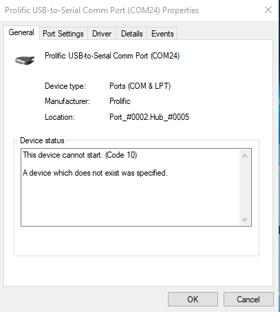
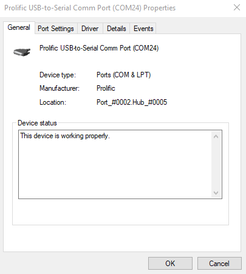
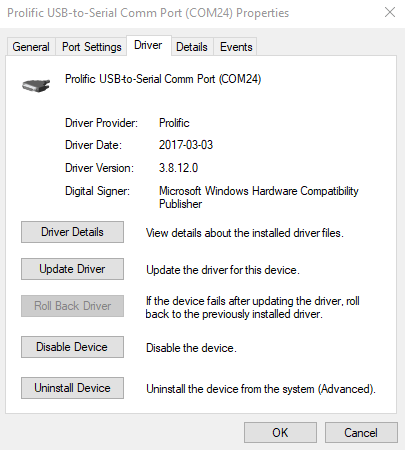
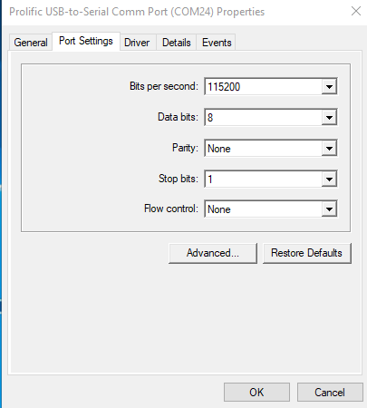

## Installing the driver for the USB to Bluetooth ##

The USB to Bluetooth module uses the "Prolific USB-to-Serial" module which traditioally have driver issues. These modules typically have counterfit Prolific chips which are not compatible with the most recent version of the firmware. 

The module will provide the depictied error:

### To solve this error we will install an earlier version of the firmware. ###

1. Disable Automatic Updates
    Windows will try to install the most up to date driver for the device when it's plugged in. While this feature is usually really helpful, in our case it will install a version that is too new.
    
    To disable this feature we need to go into:
    Control Pannel (Category View) > System and Security > System > Advanced System Setting > Hardware Tab > Device Installation Settings > No > Save Settings
    
2. Uninstall the Current Device Driver
    More then likey you have already plugged in the device and Windows has already installed the most recent driver. We must uninstall this version.
    
    Under device manager, double click on the "Prolific USB-to-Serial Comm Port". Under the "Driver" tab click "Uninstall Device". Check the box for "Delete the drever software for this device" and finally click "Uninstall"
    
    Restart your system after uninstalling the driver.
    
    Unplug the Bluetooth dongle.
    
3.  Install the Device Driver
	First plug the dongle into your computer to make sure Windows doesn't automatically install a driver. Check this by looking under in Device Manager. The Dongle should show up as something like USB-Serial Controller
	
	Now lets install the compatible driver. Make sure the dongle is unpugged before running the installer. 
	Run the PL2303_64bit_Installer.exe driver installer. The installer may have to install some additional dependencies. Let these install, restart your system, and re-run the installer. 
	The installer will prompt you to plug in the dongle after installing the driver. Restart your computer after the installer has run
	
4. Confirm proper driver installation
	To confirm that the driver has properly installed, open up your Device Manager and confirm that the "Prolific USB-to-Serial" has no errors
	

### Lastly, make sure the device is set to the correct settings ###

	
### References ###

 [How to Disable Automatic Driver Downloads on Windows 10](https://www.laptopmag.com/articles/disable-automatic-driver-downloads-on-windows-10)

 [Prolific USB-to-Serial Fix (Official Solution to 'Code 10 error')](http://www.totalcardiagnostics.com/support/Knowledgebase/Article/View/92/20/prolific-usb-to-serial-fix-official-solution-to-code-10-error)